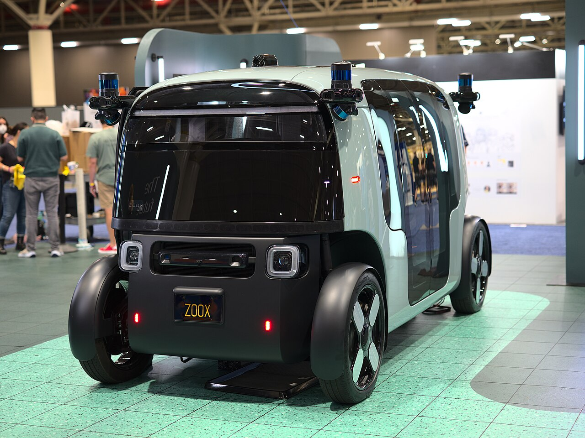
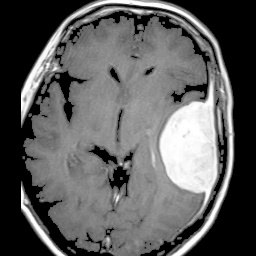
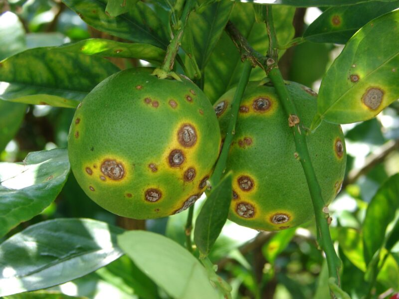
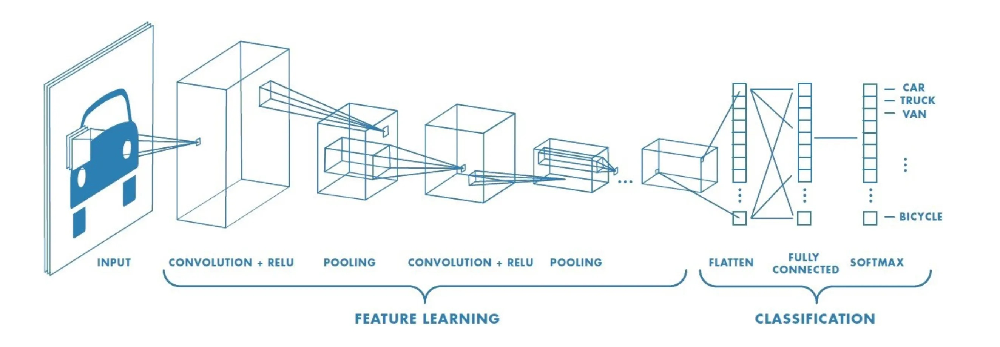
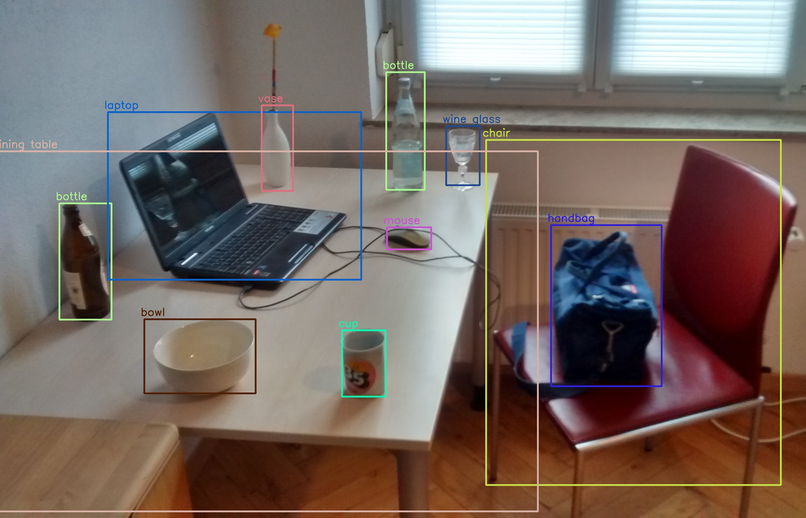
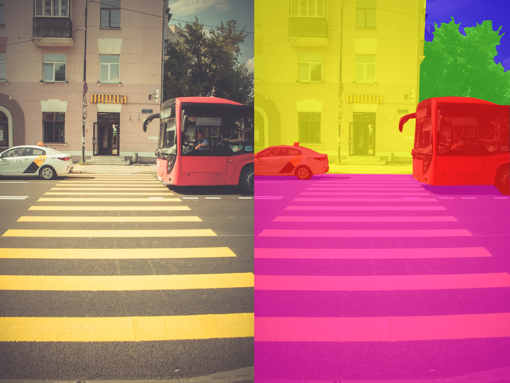
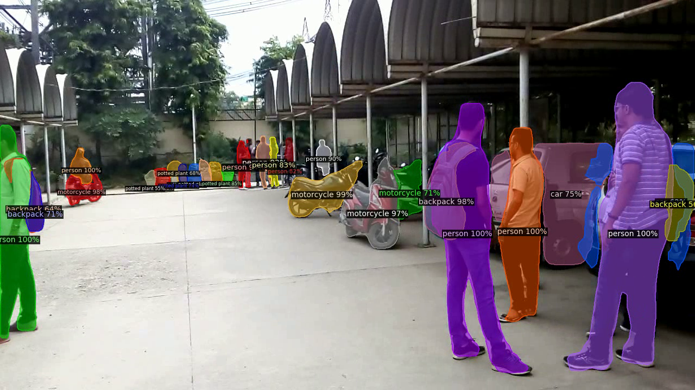
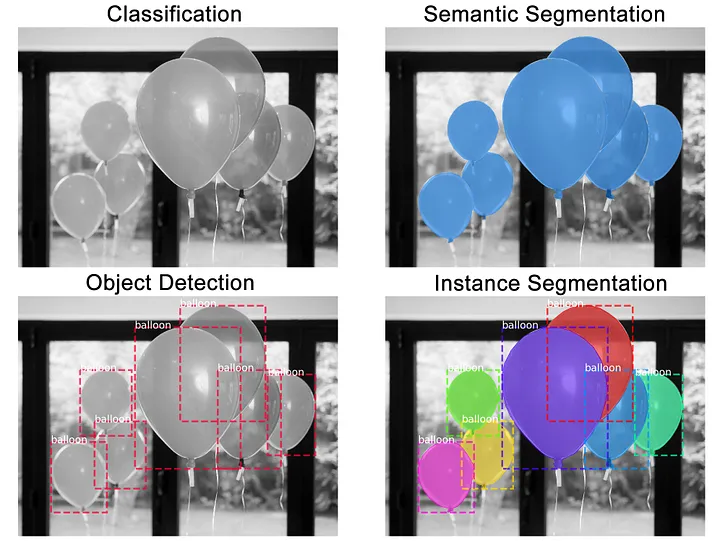

## What is computer vision? 
Computer vision is a sub-field of Artificial Intelligence (AI) that enables computers and systems to derive meaningful information from digital images, videos and other visiual inputs in a way that mimics human vision. 

## Applications of computer vision
* Autonomous vehicles: Detect and recognize objects such as pedestrians, other vehicles, traffic signs, and lane markings on the road. 
* Medical imaging: Analyze medical images such as X-rays, MRIs and CT scans to assist in diagnosis through detection of fractures or tumors with high precision.
* Facial recognition: Used in security systems, smartphones and digital applications for identifying and verifying individuals based on their facial features.
* Retail and e-commerce: Used for product recognition, inventory management, and "just walk out" technology in stores.
* Agriculture: Used for crop monitoring, pest detection, and yield estimation in agriculture.

:::: {.columns}

::: {.column width="36%"}

:::

::: {.column width="27%"}

:::

::: {.column width="36%"}

:::

::::

## Computer vision tasks

There are many computer vision tasks that have deep learning model implementations such as image classification, object detection, image segmentation, pose estimation, image generation, depth estimation, image captioning, video analysis...etc. In this document, we will go through an overview of the first three tasks to understand the requirements to solve these problems and the differences between them.

### Image classification
* Goal: Assign a label to an image.
* Question: What is the category of the object in the image?
* Input: Images with corresponding labels (e.g., cat, dog, car).
* Example Dataset: [Butterfly Image Classification](https://www.kaggle.com/datasets/phucthaiv02/butterfly-image-classification?select=Training_set.csv)
* Output: A predicted label for the image.
* Models: ResNet, Vision Transformers, EfficientNet, DenseNet, Swin Transformer, ConvNeXt 

### Object detection
* Goal: Identify and locate objects within an image.
* Question: Where are the objects in the image and what are their classes?
* Input: Images with bounding box annotations (x, y, width, height).
* Example Dataset: [Traffic Detection Project](https://www.kaggle.com/datasets/yusufberksardoan/traffic-detection-project)
* Output: Bounding boxes and class labels for each detected object.
* Models: YOLO (various versions), R-CNN, SSD, RF-DETR

### Semantic segmentation
* Goal: Assign a class label to each pixel in the image.
* Question: What is the class of each pixel in the image?
* Input: Images with pixel-level annotations (e.g., road, building, sky).
* Example Dataset: [Cityscapes Image Pairs](https://www.kaggle.com/datasets/dansbecker/cityscapes-image-pairs)
* Output: A segmented image where each pixel is labeled with a class.
* Models: U-Net, DeepLab, FCN, SegNet, PSPNet, Mask R-CNN, Mask2Former, SAM 2

### Instance segmentation
* Goal: Identify and segment individual objects in an image.
* Question: What are the boundaries of each individual object in the image?
* Input: Images with instance-level annotations (e.g., each object is labeled separately).
* Example Dataset: [Use API to get the COCO 2018 dataset](https://cocodataset.org/#detection-2018)
* Output: Segmented masks for each individual object in the image.
* Models: Mask R-CNN, YOLOv5-Instance Segmentation, RF-DETR

### Comparison of tasks

The key difference in these tasks is the levels of granularity in understanding the image.

* Image classification predicts a single label for an entire image.
* Object detection identifies and localizes multiple objects using bounding boxes while assigning a class label to each detected object.
* Semantic segmentation classifies every pixel in the image according to its category, without distinguishing between separate objects of the same type.
* Instance segmentation goes one step further by classifying each pixel and also separating different instances within the same category.

## Data
In computer vision tasks, the data typically consists of images (or videos) and their corresponding labels or annotations. The quality and quantity of data play a crucial role in the performance of computer vision models.