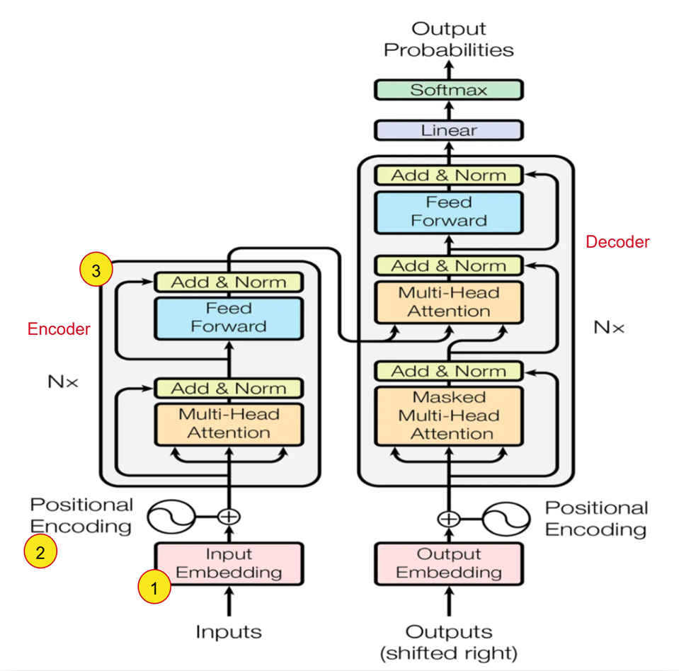
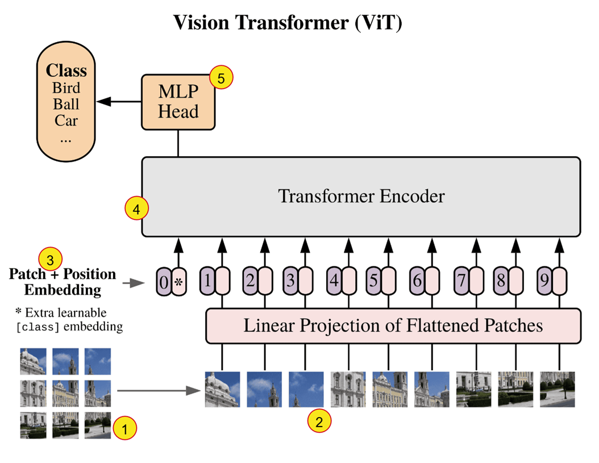
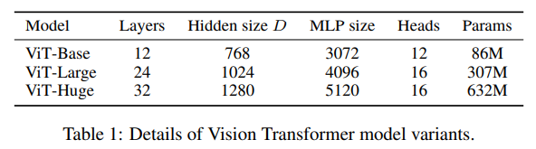

Early sequence models such as RNNs and LSTMs were designed to process text token by token, maintaining a hidden state to carry information forward through a sequence. 
While effective for short contexts, this sequential structure made it difficult to parallelize and was also prone to forgetting long-range dependencies. 

In 2017, the "Transformer" architecture introduced in the "Attention Is All You Need" paper by "Vaswani et al" helped overcome these limitations. 
This architecture uses Self-Attention wherein every word in the sentence looks at every other word to determine context. 
Since all the words are processed simultaneously, the architecture is highly parallelizable and makes this significantly faster to train on modern GPUs.   

In this document, we will focus on the relvant parts of the transformer architecture and understand how it was adapted for the Vision Transformer. It is strongly recommended to revisit the Encoder part of the Transformer and the attention mechanism as we will only be stating it here for completeness.   

## Transformer Architecture

1. **Input Embedding**: Converts the words (tokens) into a dense continuous vector representation of dimension $d_{model}$. This embedding matrix is learned during training. 
2. **Positional Encoding**: Since the model does not contain recurrence or convolution, it has no inherent notion of token order. To provide sequence information, positional encodings are added to the input embeddings. 
3. **Encoder**: Takes the input sequence and produces a representation of the input that captures relationships between all tokens. The encoder (as defined in the paper) is composed of a stack of 6 identical layers. Each of these layers has two sub-layers i.e the multi-head self-attention mechanism and position-wise fully connected feed-forward network. A residual connection is used around each of the two sub-layers and this is followed by layer-normalization.    

## Transformers in Computer Vision

For a long time in computer vision tasks, convolutional architectures such as ResNet had been the state of the art. The CNN based architectures offer many advantages in being translation invariant, parameter efficient and capturing local spatial patterns well. However, since CNNs process images using kernels, they are more suited to capturing local patterns as opposed to a global context. 

The early attempts at applying the Transformer's attention mechanism to images faced a few obstacles

* The Self-attention has a complexity of $O(N^2)$, where N is the number of inputs. The naive approach of treating each pixel as an input would thus have a significant cost for realistic input sizes to apply self-attention. 
* Other approaches required very specialized architectures to achieve good results but this required complex engineering for efficient implementation on hardware accelerators

## An Image Is Worth 16 x 16 Words

The paper "AN IMAGE IS WORTH 16X16 WORDS: TRANSFORMERS FOR IMAGE RECOGNITION AT SCALE" by "Dosovitskiy et al." introduced the Vision Transformers (ViTs) to extend the Transformer architecture successfully to computer vision tasks. Instead of processing images using convolutional layers like in CNNs or using each pixel as input, ViTs divide an image into fixed size patches and use these as input. The paper also demonstrated that this ViT can outperform traditional CNNs when trained on large datasets. 

1. The image is divided into fixed size patches (16 X 16 pixels). If we have an image of size 224 x 224, it will be input as a sequence of 196 patches (as opposed to 50176 if each pixel was input individually!).
2. These patches are flattened and mapped to D dimensions through a trainable linear projection. The output of this projection is referred to as the patch embeddings. The mapping is done to D dimensions because the Transformer uses a constant vector size D ($d_{model}$) through all of its layers.
3. The position embeddings (learnable) are added to the patch embeddings to retain positional information. We prepend this with a learnable embedding [CLS Token] whose state at the output of the encoder serves as the image reprepsentation. (The model processes all patches, but we need a single output vector to represent the entire image)
4. The encoder consists of alternating layers of multiheaded self-attention and MLP blocks with Layer Normalization before every block and residual connections after every block. 
5. The output from the encoder is direclty fed into the MLP head (Feed Forward Neural Network) to obtain the classification output. 

One key benefit of this architecture is its ability to adopt the scalable Transformer framework from NLP, enabling the use of well optimized implementations without modification.

In Transformers, pretraining refers to training a model on large, general-purpose datasets using a self-supervised objective before fine-tuning it on a specific downstream task. This allows the Transformers to learn some general purpose representations. 
The ViT was pre-trained on large datasets which include ILSVRC-2012 ImageNet dataset with 1k classes and 1.3M images, its superset ImageNet-21k with 21k classes and 14M images, and JFT with with 18k classes and 303M high-resolution images. 

This also indicates that the final MLP head in the architecture is set to predict as many classes as there are in the datasets used for pretraining. So, during fine-tuning, the MLP head is removed and re-initialized such that the output dimension of this new head matches the number of classes in the specific downstream task.    

## ViT Variants

The paper also proposes a few model variants based on number of layers, Hidden size D, MLP Size and number of heads. The same is presented in the table below: 

## Credits

* https://arxiv.org/pdf/1706.03762
* https://arxiv.org/pdf/2010.11929
* https://www.kaggle.com/code/abhinand05/vision-transformer-vit-tutorial-baseline 

